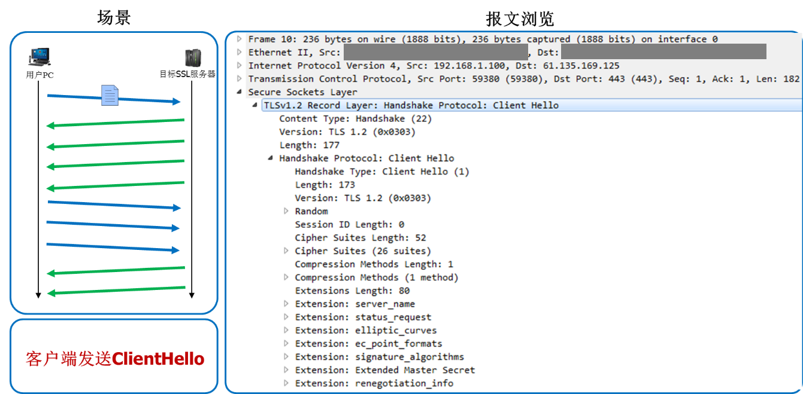
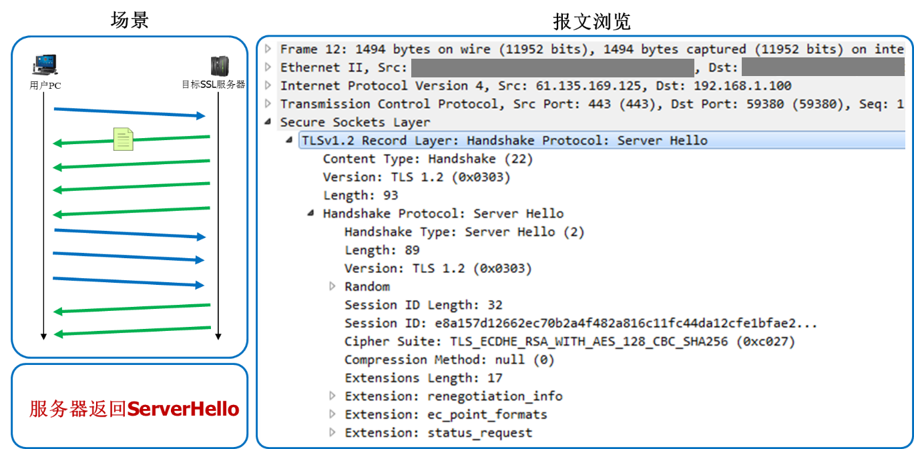
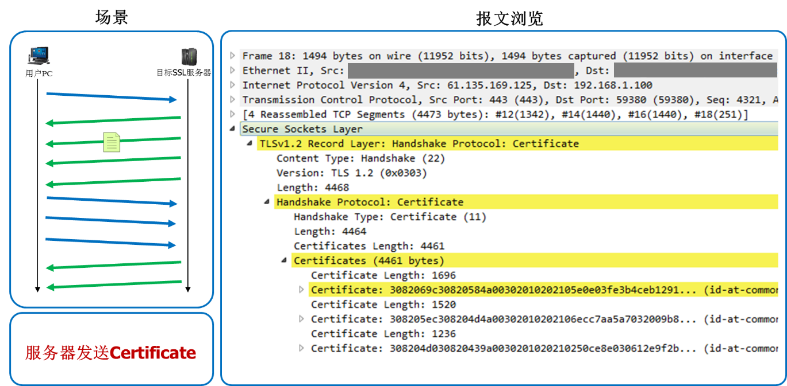
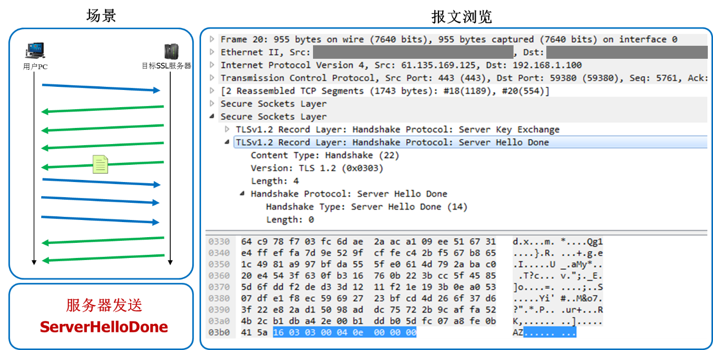
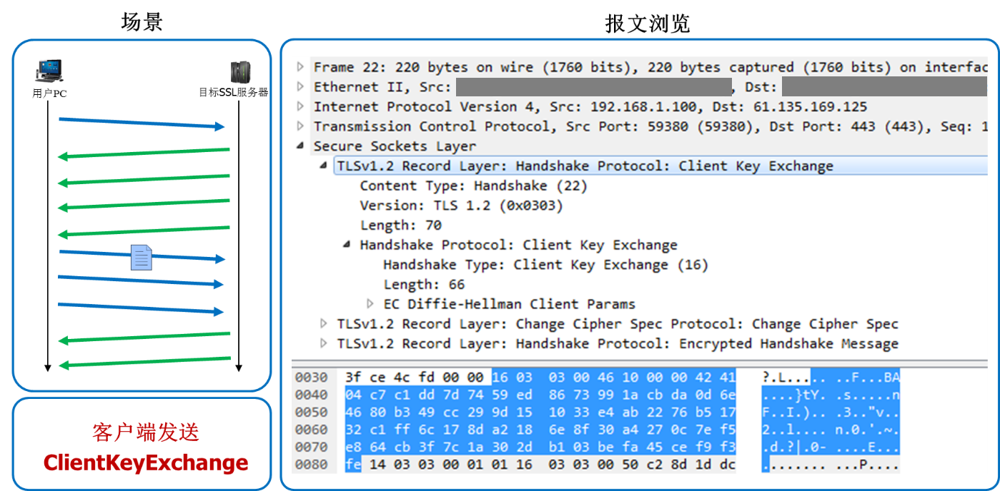
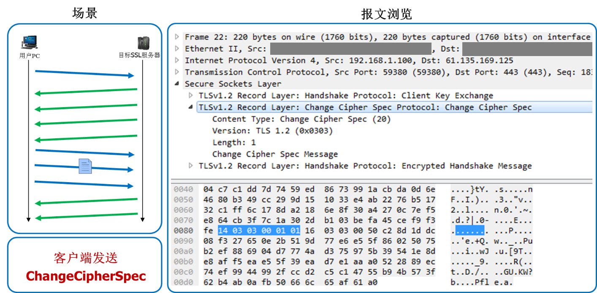
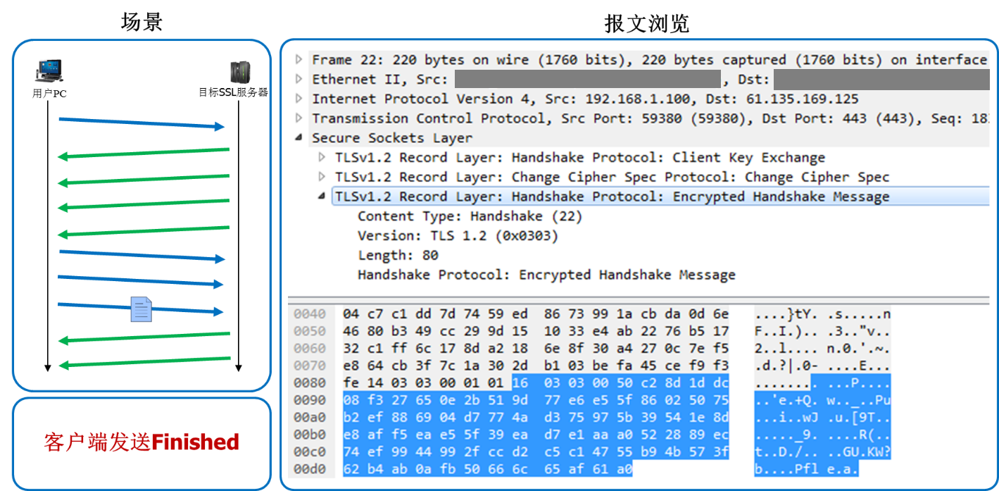
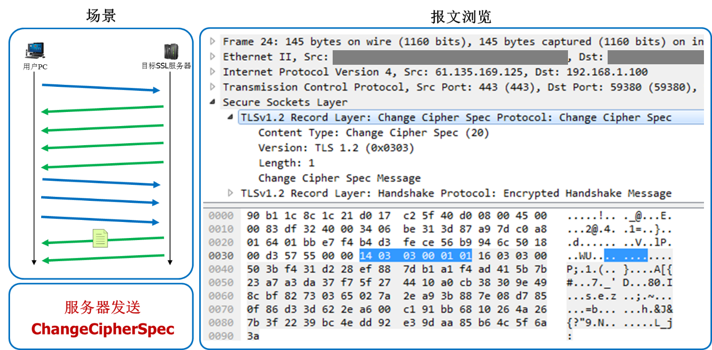
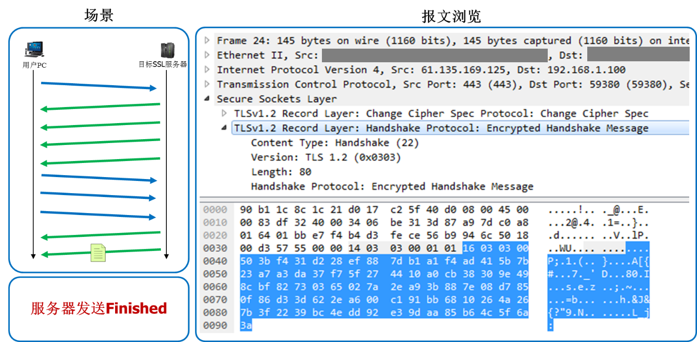

# HTTPS 通讯原理
[TOC]
## 请求流程
``` mermaid
sequenceDiagram
  participant C as 客户端
  participant S as 服务端
  opt proxy
    C->>S: 1. CONNECT
    S->>C: 2. Established
  end
  C->>S: Client Hello
  S->>+C: Server Hello
  S->>C: Certificate
  S->>C: Server Key Exchange
  S->>-C: Server Hello Done
  C->>+S: Client Key Exchane
  C->>S: Change Cipher Spec
  C->>-S: Encrypted Handshake Message
  S->>+C: Change Cipher Spec
  S->>-C: Encrypted Handshake Message
  note over C,S: Finished
  loop data change
      C-->S: Application Data
  end
  C-->S: Disconnect
```
## 流程说明
### 代理请求报文
1. 客户端使用CONNECT方法向代理服务器发送URL,告知代理服务器实际的目标地址
``` http
CONNECT www.google.com.hk:443 HTTP/1.1
Host: www.google.com.hk:443
Proxy-Connection: keep-alive
User-Agent: Mozilla/5.0 (Windows NT 6.1; Win64; x64) AppleWebKit/537.36 (KHTML, like Gecko) Chrome/73.0.3683.86 Safari/537.36
```

2. 代理服务器响应客户端的CONNECT代理请求,完成建立链接
``` http
HTTP/1.1 200 Connection Established
Proxy-Agent: Zscaler/5.6
```
### 连接建立报文
1. client端发起握手请求，会向服务器发送一个ClientHello消息，该消息包括其所支持的SSL/TLS版本、Cipher Suite加密算法列表（告知服务器自己支持哪些加密算法）、sessionID、随机数等内容。


2. 服务器收到请求后会向client端发送ServerHello消息，其中包括：
* SSL/TLS版本；
* session ID，因为是首次连接会新生成一个session id发给client；
* Cipher Suite，sever端从Client Hello消息中的Cipher Suite加密算法列表中选择使用的加密算法；
* Radmon 随机数。


3. 经过ServerHello消息确定TLS协议版本和选择加密算法之后，就可以开始发送证书给client端了。证书中包含公钥、签名、证书机构等信息。


4. 服务器向client发送ServerKeyExchange消息，消息中包含了服务器这边的EC Diffie-Hellman算法相关参数。此消息一般只在选择使用DHE 和DH_anon等加密算法组合时才会由服务器发出。


5. server端发送ServerHelloDone消息，表明服务器端握手消息已经发送完成了。


6. client端收到server发来的证书，会去验证证书，当认为证书可信之后，会向server发送ClientKeyExchange消息，消息中包含客户端这边的EC Diffie-Hellman算法相关参数，然后服务器和客户端都可根据接收到的对方参数和自身参数运算出Premaster secret，为生成会话密钥做准备。


7. 此时client端和server端都可以根据之前通信内容计算出Master Secret（加密传输所使用的对称加密秘钥），client端通过发送此消息告知server端开始使用加密方式发送消息。


8. 客户端使用之前握手过程中获得的服务器随机数、客户端随机数、Premaster secret计算生成会话密钥master secret，然后使用该会话密钥加密之前所有收发握手消息的Hash和MAC值，发送给服务器，以验证加密通信是否可用。服务器将使用相同的方法生成相同的会话密钥以解密此消息，校验其中的Hash和MAC值。


9. 服务器发送ChangeCipherSpec消息，通知客户端此消息以后服务器会以加密方式发送数据。


10. sever端使用会话密钥加密（生成方式与客户端相同，使用握手过程中获得的服务器随机数、客户端随机数、Premaster secret计算生成）之前所有收发握手消息的Hash和MAC值，发送给客户端去校验。若客户端服务器都校验成功，握手阶段完成，双方将按照SSL记录协议的规范使用协商生成的会话密钥加密发送数据。


## 附件
报文数据使用[wireshark](https://www.wireshark.org/)打开
* [HTTPS报文数据](res/001https_01.pcapng)