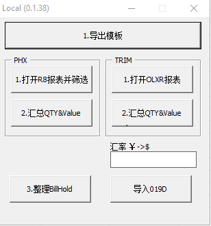
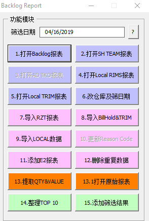

# Backlog报表整理

[TOC]

## Backlog-Local
### 操作界面
  

### 数据报表
* R8数据表
* 019D数据表

### 处理逻辑
#### PHX
##### 打开R8报表并筛选

1. 筛选R8报表
* [Status]字段 不是 'CANCELLED','BILL & DESTROY'
* [MASTER AWB] 和 [HOUSE AWB]字段为空的
* [CARTON#] 不为0的
* [REMARKS] 带有"FTY" 或是[ITEM CODE]以"/C"结尾 或是 [ITEM CODE]以"/G"结尾且[Shipping Instructions]带有"FTY"
* [SCH DATE]是1年之内的
``` sql
select * from [PHX_R8$] where [Status] not in ('CANCELLED','BILL & DESTROY') and [MASTER AWB] is null and [HOUSE AWB] is null and [CARTON#]<>0 and ([REMARKS] like '%FTY%' or right([ITEM CODE],2)='/C' or (right([ITEM CODE],2)='/G' and [Shipping Instructions] like '%fty%')) and abs([SCH DATE]-now())<366"
```
2. [DO / EI]为空的是 FGC数据
```sql
select '' as [DEPT],[Item code],[QUANTITY],[AMOUNT],[TEAM],[CARTON LOC] from [Backlog_PHX_R8$] where [DO / EI] is null
```
3. [DO / EI]不为空的是 Backlog数据
```sql
select '' as [DEPT],[Item code],[QUANTITY],[AMOUNT],[TEAM],[CARTON LOC] from [Backlog_PHX_R8$] where not([DO / EI] is null)
```
4. 导出用于Backlog Report的数据报表
``` sql
select CDate(max([EX#FACTORY DATE(ship date)])) as [Date],max([BU]) as [TEAM],max([BOCODE]) as [BOCODE],max([RBO NAME]) as [RBO NAME],max([SHIPTO VENDOR NAME]) as [ShipToName],sum([AMOUNT]) as [Value],'NS' as [WH],'' as [CTN],'' as [ReasonCode],'' as [APO],'P' as [System],'' as [PI#],'' as [CON#],'' as [TE#],[DO / EI],max([SONO]) as [PO],'' as [Release#],'' as [IssueTime],'' as [Other],'' as [Reason],'" & strOperator_NS_VAT & "' as [Follow],max([BTCODE]) as [BillCode],max([BILLTO VENDOR NAME]) as [BillName],max([SCH DATE]) as [DueDate],max([DEPT#])as [DEPT#],max([STCODE]) as [ShipToCode],max([SONO]) as [PO2],max([Remarks]) as [Remark],max([Shipping Instructions]) as [SI] from [Backlog_PHX_R8$] where not([DO / EI] is null) group by [DO / EI]
```
5. 更新CS Team
  Team字段包含"BT"的末尾数字
##### 汇总QTY & VALUE (PHX)
1. 根据Team Code更新部门 匹配不到的使用Itemcode匹配部门
2. 汇总FGC Backlog的数量跟价值

##### 导入019D
1. 根据汇率计算导入019D数据
#### TRIM
##### 打开OLXR报表
1. 筛选OLXR报表数据
```sql
select [TE_NO],min([ITEM_CODE]) as [ITEM_CODE],sum([PACK QTY]) as [PACK QTY] from [TRIM_OLXR$] where len([TE_NO])=10 and left([TE_NO],1)<>'-' group by [TE_NO]
```
2. 添加额外的数据
  提供 [TE] ,[Item_Code] ,[QTY]数据源 与第一步骤结果合并
3. 匹配部门信息
  根据Itemcode匹配部门信息
4. 匹配019D数据
  根据TE提取019D中的数据
```sql
select top 1 [Retailer],[Ship To #],[Ship To],[Bill To #],[Bill To],[Due Date],[Received],[Unit price],[Special Instruction #1],[Special Instruction #2],[Special Instruction #3],[Special Instruction #4],[Special Instruction #5],[Special Instruction #6] from [DATA_019D] where [TE]='" & Cells(i, "A").Formula & "'
```
5. 更新BO资料
  根据BO name 匹配BOCODE
6. 二次提取
```sql
select iif(cdate([Received])+3<cdate(clng(now()-0.5)),cdate([Received])+3,cdate(clng(now()-1.5))) as [Date],'' as [TEAM],[BOCODE],[Retailer] as [BONAME],[Ship To],[PACK QTY]*[Unit price] as [Value],'NS'as [WH],'' as [CTN],''as [ReasonCode],'' as [APO],'T' as [System],'' as [PI#],'' as [CON#],[TE_NO],'' as [DOEI],'' as [PO#],'' as [Release#],'' as [IssueTime],'' as [Other],'' as [Reason],'" & strOperator_NS_VAT & "' as [Follow],val([Bill To #]) as [Bill To #],[Bill To],[Due Date],[PACK QTY],[DEPT],[Ship To #],[Special Instruction #1],[Special Instruction #2],[Special Instruction #3],[Special Instruction #4],[Special Instruction #5],[Special Instruction #6] FROM [Backlog_TRIM_Local$]
```
##### 汇总QTY & VALUE (TRIM)
  使用平均单价计算价值
```vb
  d("DIGITAL") = 26.8
  d("FLEXO") = 12.2
  d("IMPRINT") = 12.2
  d("OFFSET") = 26.8
  d("PFL") = 23
  d("RFID-HT") = 71.7
  d("RFID-SB") = 72.8
```

### 整理BIILLHOLD
将BillHold数据转化成BacklogReport格式
## Backlog-ALL
### 操作界面
  